# Cloudflare Tunnel Bind App (UNOFFICIAL)

Cloudflare Tunnel Bind App은 Cloudflare의 cloudflared 터널을 GUI 환경에서 손쉽게 관리할 수 있도록 도와주는 Windows desktop 애플리케이션 입니다.  

사용자는 여러 터널 정보를 등록하고, 시작 / 중단 등 주요 기능을 직관적으로 제어할 수 있습니다.

주로 SSH 용도로 활용하기 좋습니다.

### 주요 기능
- cloudflared 미설치 시 자동 설치 안내 및 진행
- cloudflared 터널 프로세스의 시작 및 중단 관리
- 터널 정보(프로토콜, 호스트, 포트 등) 과리
- 트레이 아이콘을 통한 백그라운드 실행
- 다국어(한국어/영어) UI 지원

### 기능 효과

- 여러 터널을 동시에 효율적으로 운영
- 설치 및 환경 구성 직관화

---

### Requirements
- **Winget 사용 동의**: 최초 실행 시 `winget list` 명령을 통해 Microsoft Store 약관 동의가 필요합니다.
- **.NET Framework 4.6 (Optional)**: 프로그램 실행을 위해 .NET Framework 4.6 이상이 설치되어 있어야 합니다.
- **cloudflared (Optional)**: 프로그램에서 자동 설치를 지원하지만, 수동 설치도 가능합니다.

## Installation 방법

1. 제공된 설치용 MSI 파일을 실행하여 프로그램을 설치합니다.

    [Installation](https://github.com/was564/Cloudflare_Tunnel_Bind_App/releases/tag/version_1_0_0)

2. (최초 실행 시) cmd를 키고 winget list를 입력하여 winget 사용 동의를 합니다.

    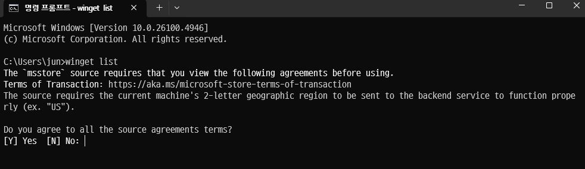

3. 설치한 프로그램을 실행하고 cloudflared가 없으면 예를 눌러 설치합니다.

    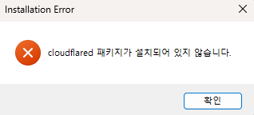
    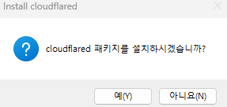

4. 정상적으로 설치되면 프로그램이 켜집니다.
    
    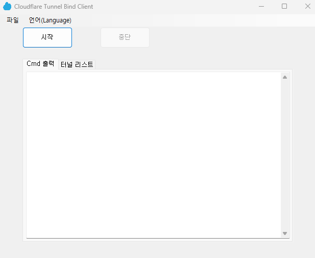

---

## Execution

SSH 연결을 위주로 설명합니다.

### Tunnel List

Tunnel list에 들어가면 연결할 Tunnel 정보를 입력하고 관리할 수 있습니다.

추가, 수정, 삭제 가능합니다.

Tunnel 정보는 아래와 같습니다.
- Protocol : TCP, RDP, SSH, SMB 중 하나
- Hostname과 local bind url은 공백 X
- Port는 0~65535 숫자만 입력

- 동일한 (Hostname, Port 번호) 데이터 입력 X

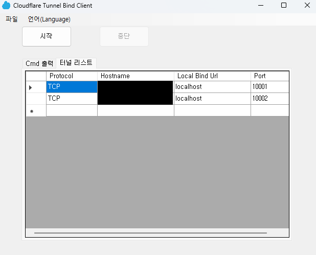

### Start

시작 버튼을 누르면 Cmd에서는 Tunnel 정보를 기반으로 Cloudflare Tunnel을 연결합니다.

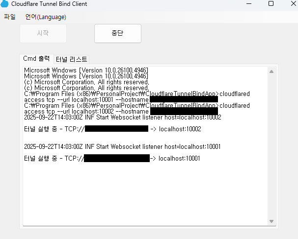

여기서 연결한 Tunnel은 CMD의 SSH 명령어로 연결이 가능합니다.

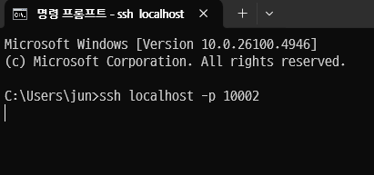

최초 연결 시에는 Cmd 출력 단에서 본인 인증을 위한 링크가 나오며 인증 진행하면 됩니다.

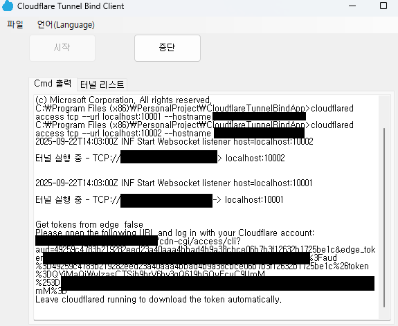
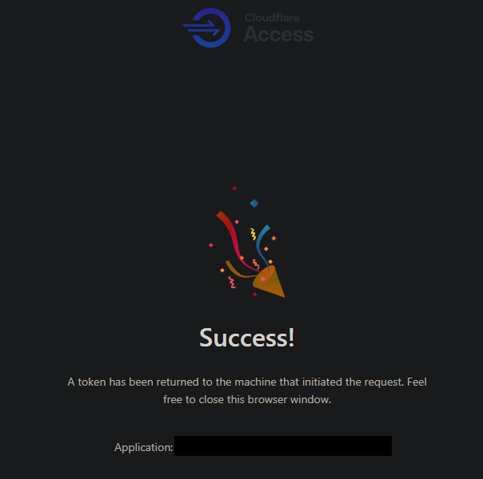
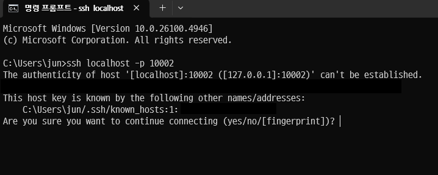

### Stop

중단 버튼을 누르면 실행되고 있던 프로세스를 전부 중단합니다.

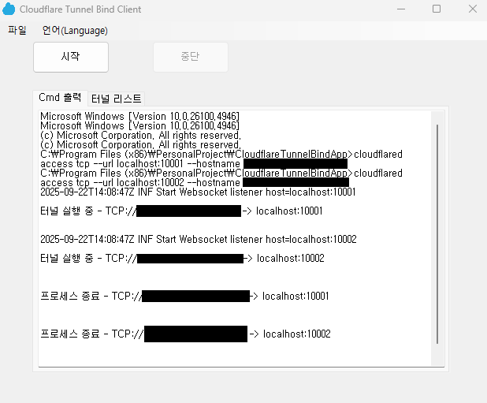

### Icon Tray

프로그램을 일반적으로 종료하면 Icon Tray로 넘어가고  
모든 프로세스는 백그라운드에서 동작합니다.

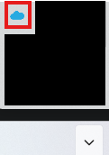

---

## Environment

- **운영체제**: Windows 10, Windows 11 (64비트/32비트)
- **CPU 아키텍처**: x86, x64 호환
- **필수 소프트웨어 (자동 설치 가능)**: .NET Framework 4.6 이상, cloudflared
